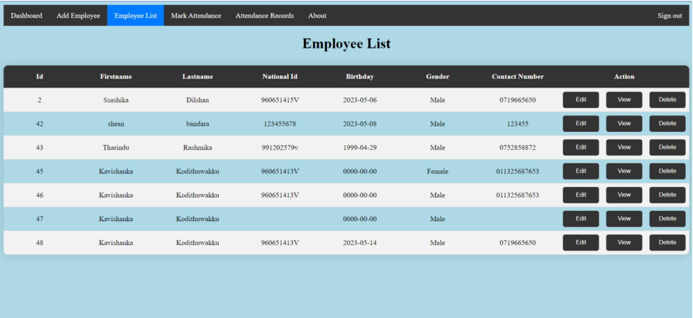

# Employee Management System

The Employee Management System is a software solution designed to address the challenges faced by businesses in managing their staff effectively. This system aims to improve productivity, accuracy, and efficiency by automating various employee-related tasks such as tracking attendance, managing employee information, and generating reports for decision-making.

## Features

- User authentication: Secure login mechanism to ensure only authorized users can access the system.
- Dashboard: Provides an overview of key information such as total employees, attendance statistics, and upcoming events.
- Add Employee: Allows users to input and store essential employee information.
- Employee List: Displays a comprehensive list of all employees with detailed profiles.
- Mark Attendance: Enables recording of employee attendance with options for different attendance statuses.
- Attendance Records: Provides a detailed overview of employee attendance history for analysis and reporting.

## Screenshots

## Technologies Used

- Front-end: HTML, CSS, JavaScript
- Back-end: PHP
- Database: MySQL

## Contributing

Contributions are welcome! If you encounter any issues or have suggestions for improvement, please open an issue or submit a pull request. Ensure that you follow the code of conduct.

## License

This project is licensed under the [MIT License](LICENSE).
